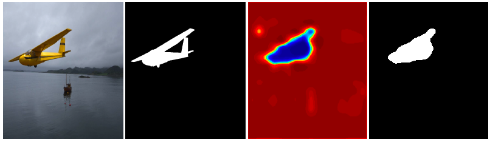
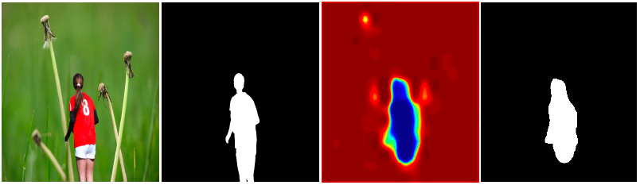

## Localization of Image Forgeries
This projects presents a high-confidence  manipulation localization architecture which utilizes resampling features, Long-Short Term Memory (LSTM) cells, and encoder-decoder network to segment out manipulated regions from non-manipulated ones. 

### Data
We create a large dataset by splicing different object obtained from MS-COCO dataset into images of DRESDEN benchmark. Please check "synthetic_data" folder for more details.


### Model
Model can be found in "./model" folder. Two models are provided- (1) finetuned with NIST'16 data, and (2) finetuned with IEEE Forensics Challenge data. Please note that the finetune is performed on base model which is trained on synthesized data.

### Resampling Features 
The codes for extracting resampling features can be found on Radon folder. Please change the input and output directory for your own use. Following is the command to extract the resampling features.
```
python extract_resamp_feat.py
```
In this code, the images are stored in hdf5 format. Please note that the package "pyfftw" needs to be installed before running the script. Please use the following command to install the package.  
```
sudo pip install pyfftw
```

### Train
First, the data needs to be prepared either hdf5 format or any other formats. The codes need to be modified accordingly. In order to train the model, an image and a corresponding binary mask is required.   

```
python train.py
```
The model will be stored in the model path. 

### Test
To evaluate the model, we provide 8 images which will be found on test_data folder. Please use the following command to run the code. 
```
python test.py
```
The code will automatically generate binary mask and heat map for the prediction score.

### Sample Outputs



### Citations
Please cite the following paper. 
```
Jawadul H. Bappy, Cody Simons, Lakshmanan Nataraj, B.S. Manjunath, and Amit Roy-Chowdhury, 
"Hybrid LSTM and Encoder-Decoder Architecture for Detection of Image Forgeries", 
IEEE Transactions on Image Processing, 2019.
```

